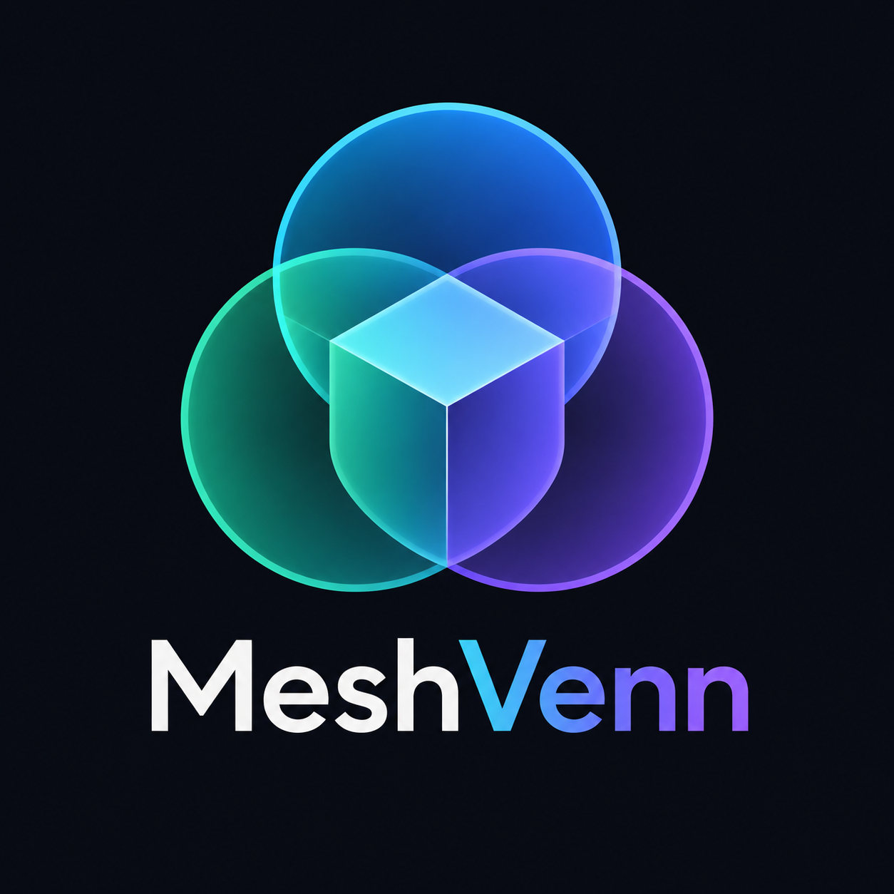

<p align="center">
  
</p>

<h1 align="center">MeshVenn</h1>

<p align="center">
  <strong>Multi-view 3D reconstruction for Blender.</strong><br>
  Turn calibrated 2D silhouettes into editable 3D geometry.
</p>

<p align="center">
  <a href="https://github.com/Slimtrat/Meshvenn/actions/workflows/ci.yml">
    
  </a>
  <a href="https://github.com/Slimtrat/Meshvenn/actions/workflows/native_ci.yml">
    
  </a>
  
  
</p>

---

## What is MeshVenn?

**MeshVenn** is an open-source Blender extension for reconstructing 3D shapes from multiple calibrated 2D projections.

Instead of generating geometry from a single image, MeshVenn intersects information from several views of the same subject to progressively constrain a shared 3D volume.

```text
             FRONT
               │
               ▼
        ┌─────────────┐
        │             │
LEFT ──▶│  3D VOLUME  │◀── RIGHT
        │             │
        └─────────────┘
               ▲
               │
              BACK
```

The resulting volume is converted into an actual Blender mesh that can then be remeshed, sculpted, retopologized, rigged and textured.

MeshVenn is particularly suited for:

* characters
* mascots
* stylized creatures
* plush-like objects
* figurines
* asymmetric designs
* turntable references
* generated multi-view character sheets
* silhouette-based object reconstruction

---

## Why "MeshVenn"?

Each projection constrains the space in which the object can exist.

MeshVenn reconstructs the shape from the **intersection of those constraints**.

```text
View A ─┐
View B ─┼──▶ common volume ──▶ mesh
View C ─┤
View D ─┘
```

The name refers to that intersection-based approach.

---

# Pipeline

MeshVenn currently follows a visual-hull reconstruction pipeline:

```text
Reference images
      │
      ▼
Alpha silhouettes
      │
      ▼
Projection calibration
      │
      ▼
Visual Hull
      │
      ▼
Voxel Volume
      │
      ▼
Surface extraction
      │
      ▼
Blender Mesh
      │
      ├──▶ Voxel Remesh
      │
      ├──▶ Smoothing
      │
      └──▶ Projected Material
```

The project combines a Blender/Python integration layer with a native reconstruction engine.

---

# Features

### Reconstruction

* Multi-view silhouette reconstruction
* Arbitrary number of projection views
* Configurable azimuth
* Configurable elevation
* Horizontal image flipping
* Enable/disable individual projections
* Transparent PNG silhouettes
* Configurable alpha threshold
* Configurable voxel resolution
* Optional X symmetry
* Automatic occupied-volume cropping
* Surface-only mesh extraction
* Shared vertex reuse
* Automatic height normalization

### View presets

Built-in workflows support common turntable layouts:

```text
4 views
8 views
16 views
```

For example:

```text
000°
045°
090°
135°
180°
225°
270°
315°
```

Additional top and bottom views can further constrain difficult geometry.

### Native reconstruction engine

MeshVenn includes a native C++ reconstruction layer designed to move expensive reconstruction work outside Blender's Python runtime.

```text
Blender UI
    │
    ▼
Python integration
    │
    ▼
Native bridge
    │
    ▼
C++ reconstruction engine
    │
    ▼
Voxel / surface data
    │
    ▼
Blender Mesh
```

The native engine has its own:

* CMake project
* headers
* sources
* tests
* dedicated CI

### Projected materials

MeshVenn can also reuse the source projections after reconstruction.

Colors from the calibrated reference images can be projected back onto the reconstructed surface to create a first material representation.

This is intended as a reconstruction aid and starting point for further texturing rather than a replacement for a complete production texturing workflow.

---

# Compatibility

Current target:

```text
Blender 5.2+
```

Primary development target:

```text
Blender 5.2.1
```

The project is designed to remain **local-first**.

No cloud service is required for reconstruction.

---

# Installation

MeshVenn automatically builds installable Blender extension archives through GitHub Actions.

Open:

```text
GitHub
→ Actions
→ CI
→ latest successful workflow
→ Artifacts
```

Download the generated extension ZIP.

Do **not** extract it.

Then in Blender:

```text
Edit
→ Preferences
→ Extensions
→ Install from Disk
```

Select the downloaded ZIP.

The internal Blender extension identifier currently remains:

```text
blender_projection_tool
```

This can remain stable independently from the public **MeshVenn** branding.

---

# Using MeshVenn

Open Blender and navigate to:

```text
3D Viewport
→ N
→ Projection Tool
```

Add projections of the same subject and assign their camera angles.

A minimal reconstruction can use:

```text
Front   0°
Right  90°
```

but this only provides a rough blockout.

A much stronger setup is:

```text
000°
045°
090°
135°
180°
225°
270°
315°
```

For difficult or strongly asymmetric objects, additional elevated views can significantly improve the reconstruction.

Example:

```text
azimuth   = 45°
elevation = 30°
```

---

# Preparing reference images

Reconstruction quality depends heavily on input consistency.

Every image should show:

* the same object
* the same pose
* the same proportions
* the same scale
* consistent centering
* consistent ground position
* minimal perspective distortion
* a clean silhouette

Transparent PNG files are recommended.

```text
RGBA

subject:
alpha = 1.0

background:
alpha = 0.0
```

The silhouette mask is derived from alpha.

Conceptually:

```python
occupied = alpha >= threshold
```

For generated character sheets, **cross-view consistency is more important than visual quality**.

---

# Reconstruction resolution

Typical voxel resolutions:

| Resolution | Recommended use               |
| ---------: | ----------------------------- |
|       `32` | debugging                     |
|       `64` | fast preview                  |
|       `96` | normal iteration              |
|      `128` | higher-quality reconstruction |
|      `192` | expensive reconstruction      |
|      `256` | experimental / heavy          |

Voxel count increases cubically:

```text
64³  =     262,144 voxels
128³ =   2,097,152 voxels
256³ =  16,777,216 voxels
```

Start low.

Increase resolution only after projection alignment is correct.

---

# Recommended workflow

```text
1. Capture or generate multi-view references
2. Remove the background
3. Import projections
4. Assign camera angles
5. Generate a low-resolution reconstruction
6. Check alignment
7. Correct projection parameters
8. Add diagonal / elevated views
9. Increase reconstruction resolution
10. Generate the surface mesh
11. Remesh / smooth
12. Project source colors
13. Sculpt corrections
14. Retopology
15. UV unwrap
16. Rig
17. Final texturing
```

MeshVenn is designed to accelerate the **first half** of that workflow.

It does not try to replace Blender's full modeling pipeline.

---

# What MeshVenn is not

MeshVenn currently performs **multi-view silhouette / visual-hull reconstruction**.

It is not traditional photogrammetry.

A visual hull cannot recover geometry that never affects any observed silhouette.

Typical limitations include:

* deep concavities
* hidden holes
* internal cavities
* geometry fully occluded in every reference
* depth information represented only by texture
* overlapping internal structures

For example, a visible indentation on the front of an object cannot necessarily be reconstructed if the external silhouette remains unchanged from every camera.

More views improve constraints but do not remove this fundamental limitation.

---

# Architecture

The repository is divided between Blender integration, reconstruction logic and the native engine.

```text
Meshvenn/
│
├── .github/
│   └── workflows/
│       ├── ci.yml
│       ├── native_ci.yml
│       ├── native_examples.yml
│       └── visual_preview.yml
│
├── branding/
│   └── logo.png
│
├── core/
│   ├── image_mask.py
│   ├── native_bridge.py
│   ├── native_loader.py
│   ├── native_mesh_builder.py
│   ├── native_scan.py
│   ├── presheet_layout.py
│   ├── projected_material.py
│   └── projection_math.py
│
├── native/
│   ├── include/
│   ├── src/
│   ├── tests/
│   └── CMakeLists.txt
│
├── docs/
├── example/
├── scripts/
│
├── operators.py
├── properties.py
├── translations.py
├── ui.py
├── version.py
├── blender_manifest.toml
├── LICENSE
└── README.md
```

---

# Development

Clone the repository:

```bash
git clone https://github.com/Slimtrat/Meshvenn.git
cd Meshvenn
```

Run the Python tests:

```bash
python -m unittest discover -s tests -p "test_*.py" -v
```

The native engine is built using CMake.

Typical native development flow:

```bash
cmake -S native -B build/native
cmake --build build/native
ctest --test-dir build/native
```

Exact build requirements may vary by platform.

GitHub Actions should remain the reference environment for reproducible builds.

---

# Continuous integration

MeshVenn uses several GitHub Actions workflows.

```text
Python / Blender validation
        │
        ├──▶ extension build
        │
        ├──▶ native engine tests
        │
        ├──▶ native examples
        │
        └──▶ visual reconstruction previews
```

The CI also creates installable Blender extension artifacts.

---

# Status

MeshVenn is under active development.

The reconstruction pipeline works, but the project should still be considered **experimental**.

APIs, reconstruction strategies, presets and internal architecture may change while the project evolves.

The current focus is on:

* reconstruction quality
* asymmetric shape handling
* native performance
* projection consistency
* surface quality
* source-image material projection
* visual regression testing

---

# Roadmap

Potential directions include:

* automatic angle detection from filenames
* folder-based turntable import
* drag-and-drop multi-image import
* automatic background removal
* automatic silhouette extraction
* automatic subject alignment
* projection debug overlays
* interactive voxel previews
* faster native reconstruction
* better surface extraction
* improved smoothing
* camera calibration
* perspective camera support
* automatic camera pose estimation
* source-image texture projection improvements
* visibility-aware material projection
* texture baking
* photogrammetry hybrid workflows
* reconstruction confidence visualization
* retopology helpers
* per-part reconstruction
* attachment / anchor points

The long-term objective is simple:

> **Make turning a coherent multi-view reference sheet into a usable Blender asset dramatically faster.**

---

# Open source

MeshVenn is developed as an open-source project.

Contributions are welcome, including:

* bug reports
* reconstruction test cases
* unusual multi-view reference sheets
* performance improvements
* native C++ optimizations
* Blender UX improvements
* documentation
* visual regression cases
* material projection improvements

Before implementing a large architectural change, opening an issue first is recommended so the direction can be discussed.

Pull requests should ideally include tests or reproducible examples when changing reconstruction behavior.

---

# Contributing

A useful contribution generally follows this flow:

```text
Issue
  ↓
Reproduction / reference case
  ↓
Implementation
  ↓
Tests
  ↓
Visual preview when relevant
  ↓
Pull Request
```

Reconstruction algorithms can easily improve one shape while breaking another.

For that reason, reproducible reference sheets and visual regression cases are particularly valuable.

---

# License

MeshVenn is free and open-source software licensed under:

**GNU General Public License v3.0 or later (`GPL-3.0-or-later`)**

See [`LICENSE`](LICENSE) for details.

You are free to use, study, modify and redistribute MeshVenn under the terms of that license.

---

<p align="center">
  
</p>

<p align="center">
  <strong>Many views. One volume. One mesh.</strong>
</p>
