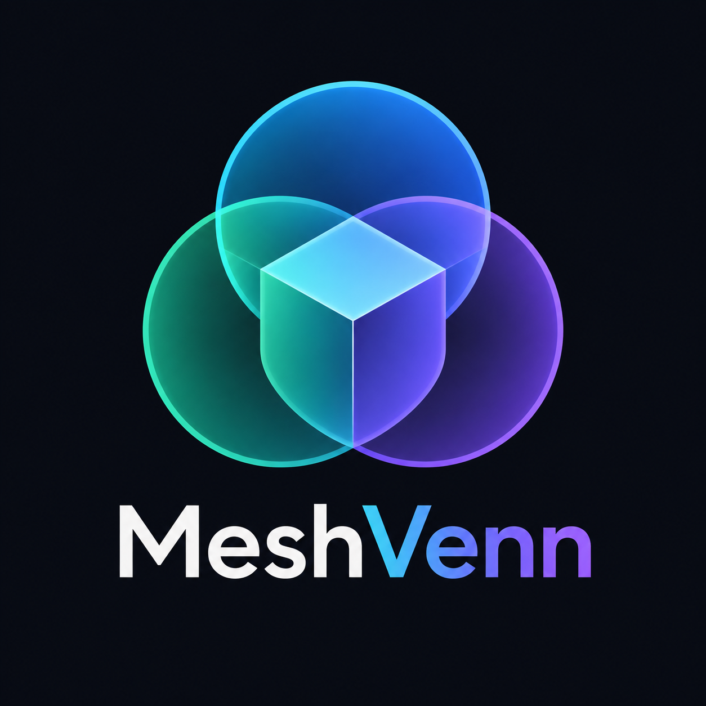

<p align="center">
  
</p>

<h1 align="center">MeshVenn</h1>

<p align="center">
  <strong>Multi-view 3D reconstruction for Blender.</strong><br>
  Turn calibrated 2D silhouettes into editable 3D geometry.
</p>

<p align="center">
  <a href="https://github.com/Slimtrat/Meshvenn/actions/workflows/ci.yml">
    
  </a>
  <a href="https://github.com/Slimtrat/Meshvenn/actions/workflows/native_ci.yml">
    
  </a>
  
  
</p>

---

## What is MeshVenn?

**MeshVenn** is an open-source Blender extension for reconstructing 3D shapes from multiple calibrated 2D projections.

Instead of generating geometry from a single image, MeshVenn intersects information from several views of the same subject to progressively constrain a shared 3D volume.

```text
             FRONT
               │
               ▼
        ┌─────────────┐
        │             │
LEFT ──▶│  3D VOLUME  │◀── RIGHT
        │             │
        └─────────────┘
               ▲
               │
              BACK
```

The resulting volume is converted into an actual Blender mesh that can then be remeshed, sculpted, retopologized, rigged and textured.

MeshVenn is particularly suited for:

* characters
* mascots
* stylized creatures
* plush-like objects
* figurines
* asymmetric designs
* turntable references
* generated multi-view character sheets
* silhouette-based object reconstruction

---

## Why "MeshVenn"?

Each projection constrains the space in which the object can exist.

MeshVenn reconstructs the shape from the **intersection of those constraints**.

```text
View A ─┐
View B ─┼──▶ common volume ──▶ mesh
View C ─┤
View D ─┘
```

The name refers to that intersection-based approach.

---

# Pipeline

MeshVenn exposes two production entry paths that converge on the same generic
Geometry contract:

```text
Reference images ──▶ silhouettes ──▶ Visual Hull / SDF ──┐
                                                         ├──▶ Blender Mesh
GLB file ──▶ validation ──▶ neutral normalization ───────┘
      │
      ├──▶ Voxel Remesh
      │
      ├──▶ Smoothing
      │
      ├──▶ Projected Material
      │
      └──▶ Canonical Rig ──▶ Motion Retarget ──▶ Validated GLB Export
```

The project combines a Blender/Python integration layer with a native reconstruction engine.

---

# Features

### Reconstruction

* Multi-view silhouette reconstruction
* Arbitrary number of projection views
* Configurable azimuth
* Configurable elevation
* Horizontal image flipping
* Per-view silhouette and color alignment (horizontal/vertical offset and uniform scale)
* Enable/disable individual projections
* Transparent PNG silhouettes
* Configurable alpha threshold
* Configurable voxel resolution
* Optional X symmetry
* Automatic occupied-volume cropping
* Surface-only mesh extraction
* Shared vertex reuse
* Automatic height normalization

### View presets

Built-in workflows support common turntable layouts:

```text
4 views
8 views
16 views
```

For example:

```text
000°
045°
090°
135°
180°
225°
270°
315°
```

Additional top and bottom views can further constrain difficult geometry.

### Native reconstruction engine

MeshVenn includes a native C++ reconstruction layer designed to move expensive reconstruction work outside Blender's Python runtime.

```text
Blender UI
    │
    ▼
Python integration
    │
    ▼
Native bridge
    │
    ▼
C++ reconstruction engine
    │
    ▼
Voxel / surface data
    │
    ▼
Blender Mesh
```

The native engine has its own:

* CMake project
* headers
* sources
* tests
* dedicated CI

The native GEOMETRY stage and batch-generation manifests record voxel retention
after every projection (view_diagnostics). An empty status identifies the
view that emptied the hull; sharp-drop warns when a later view removes at
least 90% of the remaining voxels. The warning helps diagnose mask alignment
and calibration, but does not reject a valid reconstruction.

### Projected materials

MeshVenn can also reuse the source projections after reconstruction.

Colors from the calibrated reference images can be projected back onto the reconstructed surface to create a first material representation.

This is intended as a reconstruction aid and starting point for further texturing rather than a replacement for a complete production texturing workflow.

---

# Compatibility

Current target:

```text
Blender 5.2+
```

Primary development target:

```text
Blender 5.2.1
```

The project is designed to remain **local-first**.

No cloud service is required for reconstruction.

---

# Installation

MeshVenn automatically builds installable Blender extension archives through GitHub Actions.

Open:

```text
GitHub
→ Actions
→ CI
→ latest successful workflow
→ Artifacts
```

Download the generated extension ZIP.

Do **not** extract it.

Then in Blender:

```text
Edit
→ Preferences
→ Extensions
→ Install from Disk
```

Select the downloaded ZIP.

The internal Blender extension identifier currently remains:

```text
blender_projection_tool
```

This can remain stable independently from the public **MeshVenn** branding.

---

# Using MeshVenn

Open Blender and navigate to:

```text
3D Viewport
→ N
→ Projection Tool
```

Add projections of the same subject and assign their camera angles.

A minimal reconstruction can use:

```text
Front   0°
Right  90°
```

but this only provides a rough blockout.

A much stronger setup is:

```text
000°
045°
090°
135°
180°
225°
270°
315°
```

For difficult or strongly asymmetric objects, additional elevated views can significantly improve the reconstruction.

Example:

```text
azimuth   = 45°
elevation = 30°
```

---

# Preparing reference images

Reconstruction quality depends heavily on input consistency.

Every image should show:

* the same object
* the same pose
* the same proportions
* the same scale
* consistent centering
* consistent ground position
* minimal perspective distortion
* a clean silhouette

Transparent PNG files are recommended.

```text
RGBA

subject:
alpha = 1.0

background:
alpha = 0.0
```

The silhouette mask is derived from alpha. In each view's **Align Silhouette + Color**
controls, offsets shift the source by a fraction of image width/height and scale
changes its size around the image center. Alignment is applied before Flip X
and affects both reconstruction (native visual hull or SDF) and projected
material color. Neutral values (0, 0, 1) preserve the original image exactly.
Large shifts or scales can crop a silhouette at the image edge.

Conceptually:

```python
occupied = alpha >= threshold
```

For generated character sheets, **cross-view consistency is more important than visual quality**.

---

# Reconstruction resolution

Typical voxel resolutions:

| Resolution | Recommended use               |
| ---------: | ----------------------------- |
|       `32` | debugging                     |
|       `64` | fast preview                  |
|       `96` | normal iteration              |
|      `128` | higher-quality reconstruction |
|      `192` | expensive reconstruction      |
|      `256` | experimental / heavy          |

Voxel count increases cubically:

```text
64³  =     262,144 voxels
128³ =   2,097,152 voxels
256³ =  16,777,216 voxels
```

Start low.

Increase resolution only after projection alignment is correct.

---

# Recommended workflow

```text
1. Capture or generate multi-view references
2. Remove the background
3. Import projections
4. Assign camera angles
5. Generate a low-resolution reconstruction
6. Check alignment
7. Correct projection parameters
8. Add diagonal / elevated views
9. Increase reconstruction resolution
10. Generate the surface mesh
11. Remesh / smooth
12. Project source colors
13. Sculpt corrections
14. Retopology
15. UV unwrap
16. Rig
17. Final texturing
```

MeshVenn accelerates reconstruction, first-pass materials, rigging, and motion transfer.
The three **GLB-FIRST** presets provide production entry paths that do not depend
on projection images. **GLB File V1** validates the source container, glTF
version and SHA-256 without mutating the Blender scene.

**GLB AUTO ROUTE** is the recommended product path. It resolves the registered
source skeleton profile from actual skin-joint nodes before changing the Blender scene.
E2E-tested humanoid and non-biped adapters retain their source rig, skin, clips,
morph targets and root motion. Canonicalization is an explicit conversion, not
an automatic default. Contract-only adapters do not claim automatic certification.
Static assets and unknown or
insufficient skeletons continue as geometry-only exports: optional Rig and
Motion stages are explicitly skipped and no semantic skeleton is guessed. Each
run publishes the selected route, a reason and any losses. Geometry-only fallback
on a skinned, animated or morph-equipped asset is marked **degraded**, with a UI
warning naming the data it removes; success is not a fidelity guarantee.

**GLB PRESERVE** is the default fidelity route. **GLB Preserved Character
Geometry V1** imports transactionally, keeps every source mesh, material,
armature, skin and supported action, then normalizes the character as one
hierarchy without rebuilding its topology. Normalization uses a separate,
non-animated parent so source transform channels cannot overwrite it. Source
ancestor empties are retained, including animated hierarchy parents. Auxiliary
bone-display geometry is excluded. **GLB Source Rig
Preservation V1** and **GLB Source Motion Preservation V1** expose the original
binding and clips with root motion preserved. The multi-mesh exporter publishes
that same character data.

**GLB CANONICALIZE** remains the conversion route. **GLB Normalized Geometry
V1** merges multi-mesh assets into a neutral surface, removes source skinning,
centres and scales it, then Canonical Biped and Canonical Motion rebuild the
character. Before neutralization it records hierarchy depth, bone/root counts,
rest-pose proportions and skin links. **Rig Compatibility & Routing V1** blocks
incompatible or insufficient rigs before a semantically wrong target is built.

The GLB-first **pipeline-completeness** score combines input integrity, geometry counts,
source-rig structure, semantic target compatibility, canonical rig evidence,
Motion evidence and exported-artifact integrity. A structurally healthy
quadruped therefore keeps its structural credit but receives no biped semantic
credit. Image evidence is optional and reported through coverage: no images
still yields a score, while an explicitly blank image contributes zero and
lowers the result. This keeps CI useful independently of 2D capture quality
without hiding missing evidence or a semantically invalid route. Rig and Motion
are excluded when intentionally inapplicable to a geometry-only route; a degraded
route still reports its losses even at 100% completeness. A separate
`export_fidelity_score` is `null` until export-reimport checks have passed for the
exact artifact hash. It is a sampled round-trip gate, not an anatomical quality score.

The optional RIG stage provides two compatible 18-bone A-pose implementations.
**Canonical Biped V1** is the stable default. **Canonical Biped V2** is registered
alongside it and measures each arm's span/trajectory and local joint depth from
trimmed surface envelopes. UV-seam duplicates do not change the fit or inflate
confidence. Its skinning regions follow fitted shoulders/hips rather than the
arm-pose-dependent overall width. Dense blocks with broad false arm envelopes
are rejected before any binding is created. Both
implementations expose the same semantic bone contract for downstream animation
systems, with normalized weights and at most four influences per vertex. V1 can
fall back to that deterministic binding when Blender's bone-heat solver fails.
It works from either built-in GEOMETRY implementation through the generic
surface contract. The rig stage remains disabled by default; enable it in the
pipeline only for an upright character whose local Z axis is up and whose front
faces -Y. A GLB export can carry the armature and skin when both mesh and
armature are selected. The stage reports non-blocking rig-quality diagnostics
(height-to-width ratio, lateral envelope asymmetry, and bilateral vertex
coverage) in the stage metadata and on the mesh. V1 warnings remain non-blocking;
V2 rejects insufficient arm observations and unsuitable silhouettes. Binding
failures restore existing user groups, modifiers, transforms and rig metadata.

V2 CI now starts from three verified unrigged GLBs: RiggedFigure and the two
Quaternius humanoids. Source bones/weights only provide scoring references and
are unavailable to the fitter. It gates 17 joint errors, normalized four-weight
skinning, mean unrelated arm weights, localized pose response before/after
reimport and fail-before-publish export fidelity. The axial/hip height anchors
are not anatomical certification. When triangle topology is available, closed
horizontal sections measure each leg's centreline and foot-to-ankle narrowing.
A calf/thigh narrowing or supported centreline bend supplies a knee cue. Hip
height then uses an explicit 0.95 femur/tibia length prior anchored to those
observations; the pelvis anchor is raised only when both hips are supported.
Open/featureless sections, missing cues or disagreeing hip estimates retain
canonical anchors with specific fallback reasons. Changes below 1% of model
height keep stable anchors within observation resolution. Axial heights remain
priors; arm coverage confidence and lower-body evidence are reported separately.
CI independently gates six leg-joint errors, leg-weight leakage and unilateral
leg deformation before/after GLB reimport. V1 and default routing stay unchanged.

V2 blends shoulder/hip regions across wider fitted-joint neighbourhoods and
favours adjacent torso bones over distant axial influences at limb roots. Its
regression benchmark probes 16 bilateral world-axis poses: shoulders at ±60°
around Y/Z, hips at ±60° around X and ±35° around Y. Unique surface-edge length
ratios within 12% of height around each joint measure compression and stretch,
including the worst edge and worst-pose p95. Fixture-specific budgets gate both
the generated rig and the reimported GLB, and compare matching probes across
export independently of imported bone rolls. Diagnostic rotations restore full
pose state even on failure. This is a local distortion gate, not a certificate
for anatomical motion, volume preservation, intersections or arbitrary poses.

Elbows/knees are covered by 24 additional bilateral stress poses at ±45° and
±90°: forearms around world Y/Z, shins around world X. V2 fades distant chains
out near the fitted hinge and broadens its parent/child weight transition, while
retaining the ambiguous midline fallback and normalized four-influence limit.
The hinge edge gate includes edges with at least one endpoint near the joint so
coarse meshes cannot hide transitions between widely spaced vertex rings. It
has separate fixture budgets and the same export/reimport comparison. These
stress axes include non-anatomical directions; the GLB still uses linear skinning
and can lose volume at deep bends. V1 and AUTO routing remain unchanged.

This is an envelope fit, not anatomical inference.
Extreme/unsupported poses, non-bipeds, facial rigs, and production retopology still need
purpose-built work. V2 remains opt-in so existing scenes and default behavior do
not switch silently.

The optional **Canonical Motion Retarget V1** stage accepts an external animated
GLB, detects its source-skeleton adapter, maps 17 semantic roles onto the
generated canonical rig, and bakes quaternion actions in rest/global space. Bone
matching tolerates case, common separators and FBX/glTF namespaces, but rejects
ambiguous normalized names. The canonical root remains fixed in IN_PLACE mode.
Import, bake and cleanup are transactional: an unsupported or broken source
leaves the target rig unchanged. The source GLB is selected directly in the
Motion card.

**Preserve Pelvis Height** is an opt-in Motion setting (off by default). It
transfers vertical pelvis displacement, scaled by target/source rest-mesh
height, while keeping the canonical root fixed and preserving the existing
rotation solve. It is not foot locking or IK: crouch/jump height is retained,
but different leg proportions and skinning can still cause floor penetration
or sliding. Headless callers set `motion_preserve_pelvis_height=True` in pipeline
metadata. Source-preservation routes and default AUTO routing are unchanged.

**Contact IK** is a separate opt-in setting (also off by default), requiring
Preserve Pelvis Height. It bakes thigh/shin corrections from inferred source
sole contacts, with evaluated-skin feedback and a flat rest-floor clearance of
0.002 model heights. Foot orientation, pelvis height, upper-body motion and the
fixed root are preserved; transitions fade over 0.08 seconds. The source's
relative sole trajectory is retained, including treadmill travel and any
source sliding: this is not world-space foot locking or physics. Unreachable
targets are not stretched and residual/limited samples are explicitly reported
in Motion metrics. It rejects unsupported target transforms, constraints,
drivers, bone inheritance, missing sole patches and topology-changing modifiers;
any failure rolls back the target animation and temporary imports. Headless
callers additionally set `motion_contact_ik=True`. The unchanged FK fidelity
gate and the new independent IK/contact gates run separately in V2 CI.

Six deterministic adapters are registered: Khronos RiggedFigure, Khronos Fox,
three.js RobotExpressive, Mixamo humanoid, Unreal Mannequin and Meshvenn
Canonical. RiggedFigure, RobotExpressive, Fox, QuaterniusHuman (Mixamo-compatible)
and Quaternius UAL1 (Unreal-compatible) are E2E-tested through source preservation
with respectively 1, 14, 3, 7 and 43 clips. UAL1 includes four deliberately static
reference poses; their source keyframes and preserved poses are checked separately
from moving clips. These CC0 fixtures are not Adobe or Epic assets, and passing
them does not certify every external skeleton variant or an Unreal Engine import.
RiggedFigure and RobotExpressive are also certified through the
canonical humanoid route. Fox remains deliberately rejected by Canonical Biped,
but now completes through its semantically correct quadruped source rig. The
Meshvenn Canonical adapter remains contract-tested. RiggedSimple is classified
as insufficient because two generic bones
cannot establish a complete mapping. Heuristic mapping of unknown skeletons is
not supported. The automatic Blender/CI matrix verifies RiggedFigure and
RobotExpressive, Fox and both Quaternius fixtures through source preservation, and
RiggedSimple plus ToyCar through the geometry-only safety route.

The optional **GLB Export V1** stage publishes single- or multi-mesh geometry as
a glTF 2.0 binary. When compatible Rig and Motion outputs are enabled, the same
export carries either the canonical or preserved source skin and the explicitly
produced motion clips. The stage writes to a temporary sibling file, validates the GLB container and
manifest, records its size and SHA-256 digest, then atomically publishes it to
the chosen path. Existing files are replaced only when the overwrite option is
enabled. Neither the GLB input nor the Motion source can be a destination, even
with overwrite enabled, including hard-link aliases and resolved parent paths.
Source protection is rechecked before publication.

**Verify Export by Reimport** defaults to enabled in the UI. API callers enable it
with `export_validate_roundtrip=True` in pipeline metadata. Before publication,
the temporary GLB is reimported transactionally and compared with observations
captured **before** export: rest geometry, five matching integer-frame samples
per clip, normalized skin influences, bone hierarchy, clip duration, morph count,
and sampled PBR material/texture observations. Preserved multi-slot clips use
NLA-track export; canonical clips use Action export. Positions must agree within
0.02% of rest extent and skin weights within 0.0001. Duration quantization up to
one scene frame is allowed. A failed check leaves an existing destination intact
and cleans up imported data and the temporary file. This adds import/sampling
time and memory; the report states the checked scope and measured errors.

This first exporter intentionally targets `.glb` only. Its checks establish
artifact integrity, pipeline provenance and optional sampled export fidelity;
they do not guarantee identical
rendering in every external engine or DCC application.

It does not try to replace Blender's full modeling pipeline.

---

# What MeshVenn is not

MeshVenn currently performs **multi-view silhouette / visual-hull reconstruction**.

It is not traditional photogrammetry.

A visual hull cannot recover geometry that never affects any observed silhouette.

Typical limitations include:

* deep concavities
* hidden holes
* internal cavities
* geometry fully occluded in every reference
* depth information represented only by texture
* overlapping internal structures

For example, a visible indentation on the front of an object cannot necessarily be reconstructed if the external silhouette remains unchanged from every camera.

More views improve constraints but do not remove this fundamental limitation.

---

# Architecture

The repository is divided between Blender integration, reconstruction logic and the native engine.

```text
Meshvenn/
│
├── .github/
│   └── workflows/
│       ├── ci.yml
│       ├── native_ci.yml
│       ├── native_examples.yml
│       └── visual_preview.yml
│
├── branding/
│   └── logo.png
│
├── core/
│   ├── image_mask.py
│   ├── native_bridge.py
│   ├── native_loader.py
│   ├── native_mesh_builder.py
│   ├── native_scan.py
│   ├── presheet_layout.py
│   ├── projected_material.py
│   └── projection_math/
│       ├── __init__.py
│       ├── coordinates.py
│       ├── models.py
│       ├── projection.py
│       └── vectors.py
│
├── implementations/
│   ├── __init__.py
│   ├── catalog.py
│   ├── registration.py
│   └── projection_images/
│       ├── __init__.py
│       ├── context.py
│       ├── implementation.py
│       ├── models.py
│       └── preparation.py
│
├── native/
│   ├── include/
│   ├── src/
│   ├── tests/
│   └── CMakeLists.txt
│
├── docs/
├── example/
├── scripts/
│
├── operators/
├── properties/
├── translations.py
├── ui/
├── version.py
├── blender_manifest.toml
├── LICENSE
└── README.md
```

---

# Development

Clone the repository:

```bash
git clone https://github.com/Slimtrat/Meshvenn.git
cd Meshvenn
```

Run the Python tests:

```bash
python -m unittest discover -s tests -p "test_*.py" -v
```

The native engine is built using CMake.

Typical native development flow:

```bash
cmake -S native -B build/native
cmake --build build/native
ctest --test-dir build/native
```

Exact build requirements may vary by platform.

GitHub Actions should remain the reference environment for reproducible builds.

---

# Continuous integration

MeshVenn uses several GitHub Actions workflows.

```text
Python / Blender validation
        │
        ├──▶ extension build
        │
        ├──▶ native engine tests
        │
        ├──▶ native examples
        │
        └──▶ visual reconstruction previews
```

The CI also creates installable Blender extension artifacts.

The [GLB reference examples V2](example/v2/README.md) provide ten pinned,
individually licensed models. A dedicated CI workflow benchmarks reconstruction
from ten rendered views and publishes silhouette, 3D surface and rig-quality scores.
It also gates the complete product path through fresh rigging, Motion, GLB Export
V1 and reimport, while the package workflow separately checks a static exported
artifact from the installable extension.

---

# Status

MeshVenn is under active development.

The reconstruction pipeline works, but the project should still be considered **experimental**.

APIs, reconstruction strategies, presets and internal architecture may change while the project evolves.

The current focus is on:

* reconstruction quality
* asymmetric shape handling
* native performance
* projection consistency
* surface quality
* source-image material projection
* visual regression testing

---

# Roadmap

Potential directions include:

* automatic angle detection from filenames
* folder-based turntable import
* drag-and-drop multi-image import
* automatic background removal
* automatic silhouette extraction
* automatic subject alignment
* projection debug overlays
* interactive voxel previews
* faster native reconstruction
* better surface extraction
* improved smoothing
* camera calibration
* perspective camera support
* automatic camera pose estimation
* source-image texture projection improvements
* visibility-aware material projection
* texture baking
* photogrammetry hybrid workflows
* reconstruction confidence visualization
* retopology helpers
* per-part reconstruction
* attachment / anchor points

The long-term objective is simple:

> **Make turning a coherent multi-view reference sheet into a usable Blender asset dramatically faster.**

---

# Open source

MeshVenn is developed as an open-source project.

Contributions are welcome, including:

* bug reports
* reconstruction test cases
* unusual multi-view reference sheets
* performance improvements
* native C++ optimizations
* Blender UX improvements
* documentation
* visual regression cases
* material projection improvements

Before implementing a large architectural change, opening an issue first is recommended so the direction can be discussed.

Pull requests should ideally include tests or reproducible examples when changing reconstruction behavior.

---

# Contributing

A useful contribution generally follows this flow:

```text
Issue
  ↓
Reproduction / reference case
  ↓
Implementation
  ↓
Tests
  ↓
Visual preview when relevant
  ↓
Pull Request
```

Reconstruction algorithms can easily improve one shape while breaking another.

For that reason, reproducible reference sheets and visual regression cases are particularly valuable.

---

# License

MeshVenn is free and open-source software licensed under:

**GNU General Public License v3.0 or later (`GPL-3.0-or-later`)**

See [`LICENSE`](LICENSE) for details.

You are free to use, study, modify and redistribute MeshVenn under the terms of that license.

---

<p align="center">
  
</p>

<p align="center">
  <strong>Many views. One volume. One mesh.</strong>
</p>
