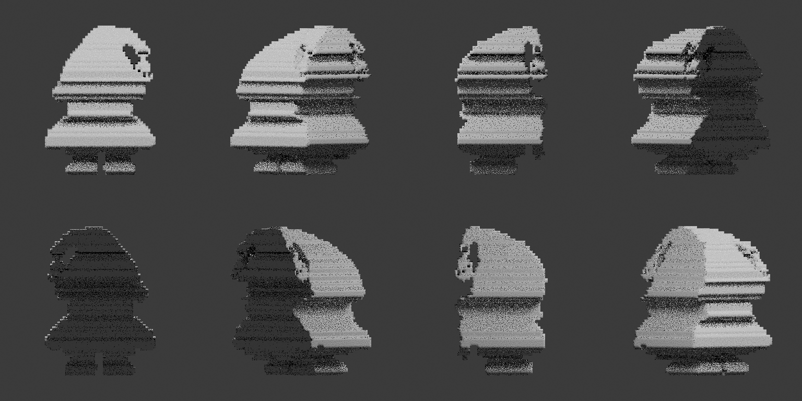
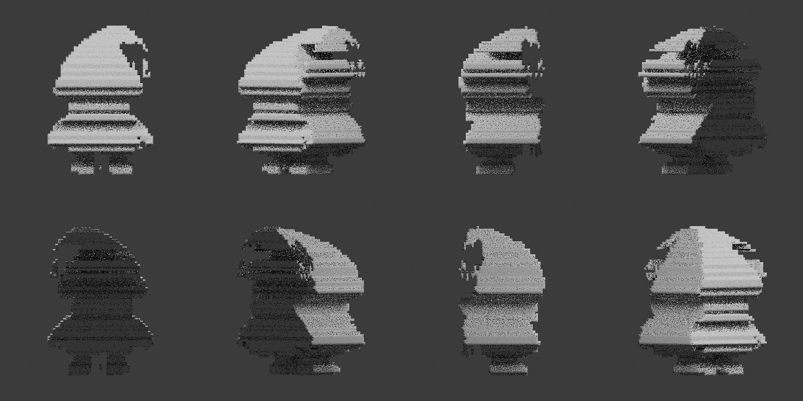
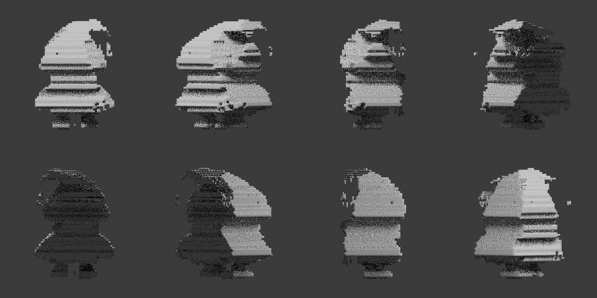
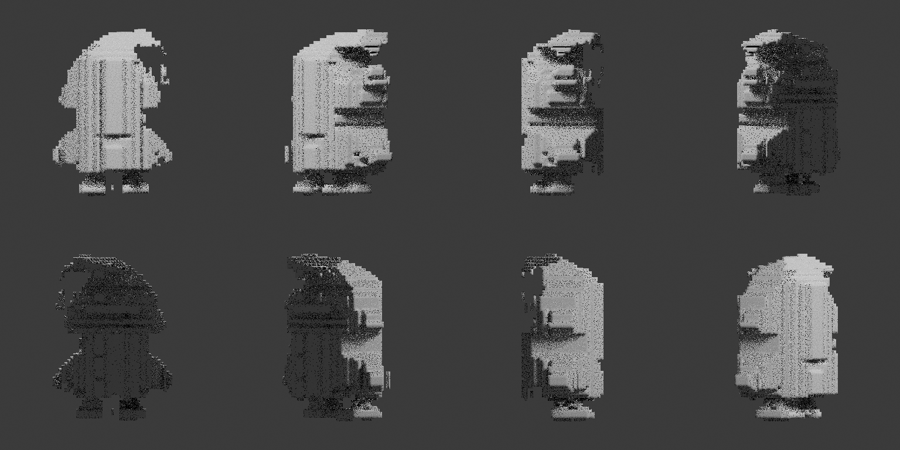
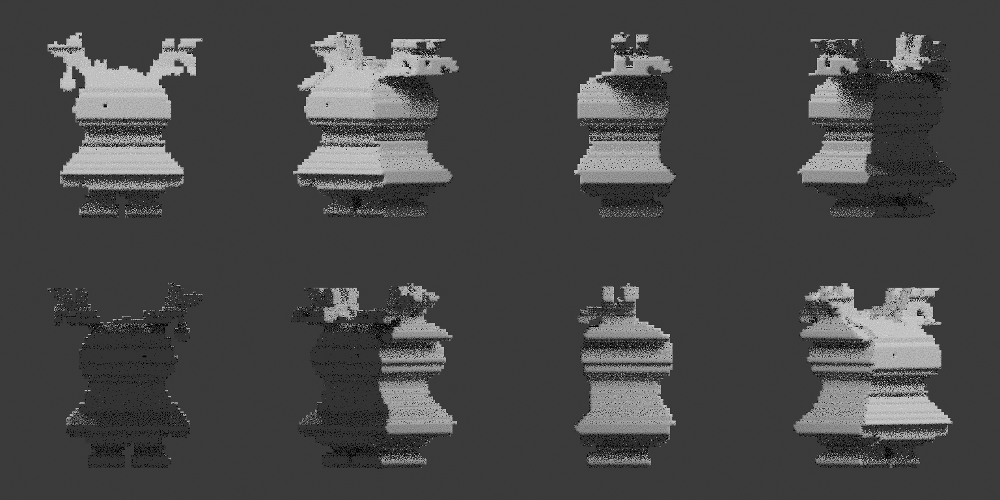
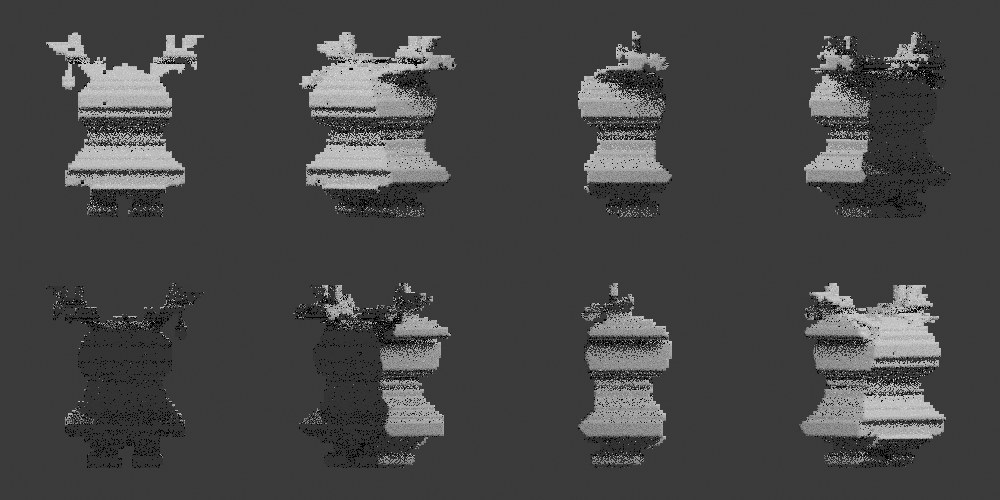
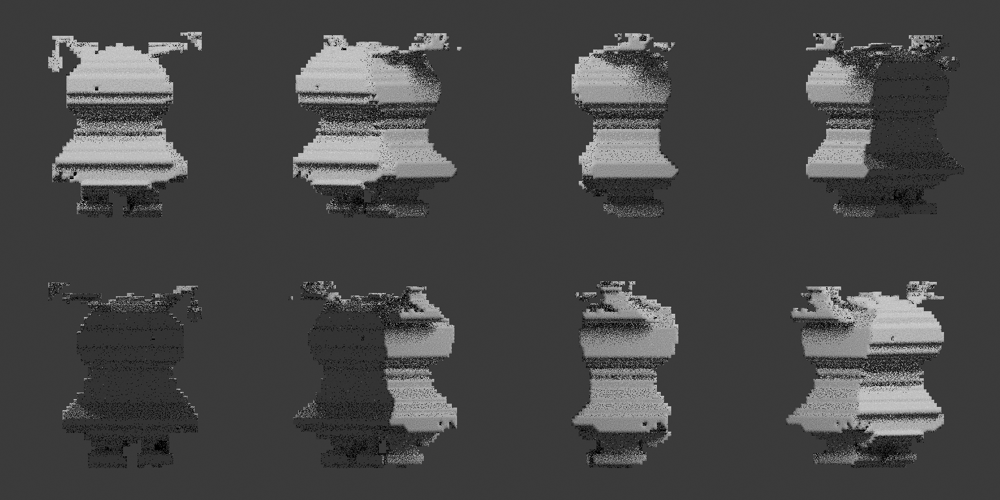
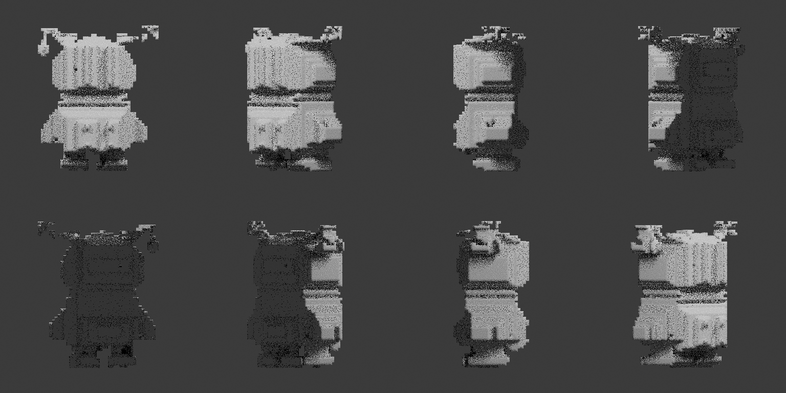

# Visual Reconstruction Preview

This page is generated automatically from the reference sheets.

It provides a quick visual check of the native C++ reconstruction pipeline.

## Scan levels

- **L2** — 000° + 090°
- **L4** — 000° + 090° + 180° + 270°
- **L8** — 8 horizontal views
- **L10** — L8 + TOP + BOT

---

## Sheet 1

### L2

### L4

### L8

### L10

---

## Sheet 2

### L2

### L4

### L8

### L10

---

## Generation

These images are generated by GitHub Actions using:

- the native C++ visual hull engine;
- Blender headless;
- Cycles CPU;
- the example reference sheets in `example/mascotte/test1/sheets/`.

The committed images represent the latest successful preview generated from `main`.
