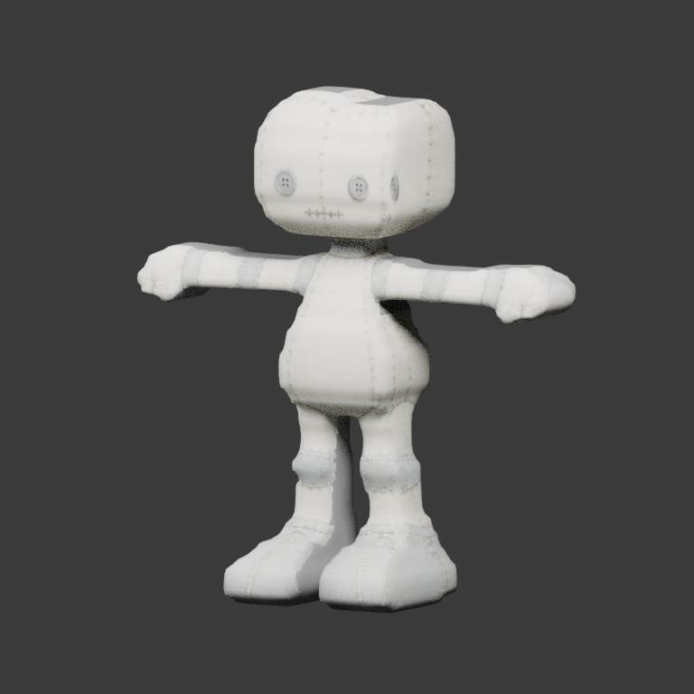
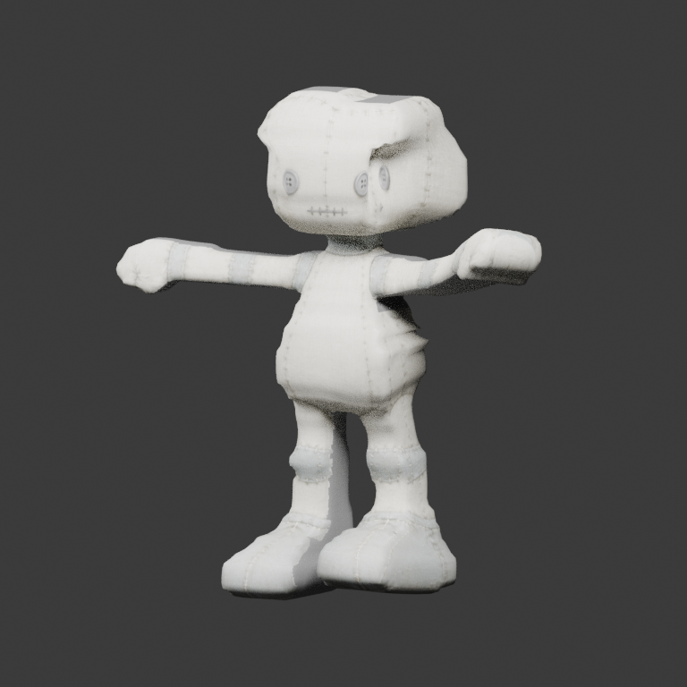

# Stytch workshop doll — native-source modular bundle

This is the **actual workshop doll**, not a UAL1 replacement or a new reconstruction.
The source owner authorized publishing the complete bundle, including packed
images. Origin: `Stytch0/Stytch` revision
`47cd554510c6229fe01a8b56cb16660f846a1ed2`,
`godot/Stytch.GodotHost/Assets/Embodiment/Candidates/MeshVennV2/`.
This source is not one of the separately licensed CC0/Khronos benchmark assets;
no third-party CC0 attribution or license is inferred here.

Original generation: Meshvenn `v0.1.175`, revision
`541986da530c28543f342b50a23fac3dfb771fbc`, native build run `37456362607`.
The reference GLB SHA-256 is
`169ec90b326ccb71c1868dc26e7676e80a53990e9906a6ab4d23af04118d2034`.
The original `.blend` SHA-256 is recorded in `manifest.json`; the delivered
`source.blend` is its editable modular-authoring derivative, not the original bytes.

## Delivered authority

- `character.glb`: only five skinned surface nodes; no hidden whole-body mesh.
- `source.blend`: packed images, unchanged authoritative `MeshvennScan` and
  `MeshvennCanonicalRig`, plus visible derived modular previews. The hidden original
  in Blender is authoring authority and is **not** included in the exported GLB.
- `authoring.json`: complete, hash-linked whole-face ownership and socket TRS.
- `partition-authoring.json`: frozen source-specific face selections and vertex
  landmarks, with their design rationale. No runtime geometric/weight classifier.
- `reference.glb`: pinned original full-body export for independent comparison.
- `manifest.json`: artifact/source hashes, fidelity, provenance and known limits.

The source has 7,128 vertices, 7,126 quads and **14,252 triangles** (budget 18,000),
18 unchanged native joints and **0 animation clips**. Height remains 1.82 m;
native ancestor scale and `regional-fitted-v2-leg-root-transfer` weights are retained.
Stytch runtime posing is not converted into invented upstream animation clips.

| Region | Owned source faces | Socket parent / owner |
| --- | ---: | --- |
| body-core | 3,400 | head → head; back/wing → chest; backpack → spine |
| left-arm | 674 | left-arm → hand.L / left-arm |
| right-arm | 674 | right-arm → hand.R / right-arm |
| left-leg | 1,168 | left-leg → foot.L / left-leg |
| right-leg | 1,210 | right-leg → foot.R / right-leg |

The entire head/neck belongs to body-core. Socket IDs are `attach-<role>`;
all eight include full native-joint-local translation, quaternion **xyzw** and
scale. Local socket scales remain approximately 1: consumers must retain the
native rig's ancestor normalization, not cancel it. Back/backpack/wing face
backwards. `socket_authoring` records exact source vertex anchors and target rest
world matrices. Seams are open shared boundaries, with no added caps or overlays.

## Editing and No Rebuild

Copy the bundle before editing. Open `source.blend` with Meshvenn installed and
select the original `MeshvennScan`, not a derived `Doll_*` preview. Use the EXPORT
face-ownership tools: load declared ownership, select **whole faces** in Edit mode,
assign an existing region ID, then explicitly enable JSON overwrite when saving.
Saving preserves the current JSON's socket TRS. Every face must have one declared
owner and all regions must remain represented. Geometry changes invalidate the
ordered surface fingerprint and require new explicit authoring.

Choose a new Output GLB, then **Export Authored Source (No Rebuild)**. The bundle's
paths are `//authoring.json` and `//character.glb`; output overwrite is disabled.
The committed empty native catalogue allows ordinary No Rebuild. The separate
static-initialization action is only for older sources without a catalogue and
refuses source/hierarchy Actions, NLA strips and drivers. It never repairs a broken
catalogue by discarding its motion.

Reproduce with Blender **5.2.1**, from the repository root, using new empty output
directories:

```sh
python -m unittest tests.test_workshop_doll_fixture -v
blender --background --factory-startup --python-exit-code 1 \
  --python scripts/author_stytch_doll.py -- --output tmp/doll-authored
blender --background --factory-startup --python-exit-code 1 \
  --python tests/blender_workshop_doll_smoke.py -- --output tmp/doll-relocated
blender --background --factory-startup --python-exit-code 1 \
  --python scripts/render_workshop_doll_preview.py -- \
  --fixture tmp/doll-authored --output tmp/doll-previews
```

CI replays the public face editor and No Rebuild while reconstruction, baking,
rigging and retarget stages are explicitly forbidden. It also exports a relocated
copy containing **only the `.blend` and JSON**, verifies rollback on failure,
and runs the same test against the packaged add-on. Separate attempt-suffixed
`stytch-workshop-doll-*` artifacts contain actual GLB renders and machine-readable
proofs, attributed to the tested commit. The UAL1 43-clip sticky is unchanged and
must not be presented as this static doll's evidence.

## Fidelity is not visual or consumer certification

The selected source's positions, topology, corner normals, UVs, materials, pixels,
weights and rest rig are checked unchanged. The final GLB reproduces the original
decoded triangle/UV multiset, winding, tessellation, weights, inverse binds and
embedded PNG bytes. Against the **older whole-body GLB**, normal components differ
by up to approximately `6.22e-5`; that comparison is diagnostic, not the unchanged
strict source-normal gate (`2e-6`, measured raw source error **0**). Blender's
imported display-normal codec delta is reported separately.

This intentionally retains the original two-view bake: **340,385 / 607,569 samples
(56.02%) use neutral fallback**, with one reported UV-overlap pixel. Full appearance
qualification is **false**. No newer micro-finish, extra view, rebake or replacement
geometry is applied. Compound renders are deterministic deformation **probes**,
not animation clips or evidence of good anatomical deformation; inherited
skinning pinches remain visible. Hiding a limb has no measurable effect on other
regions, but does not create a sealed wound cap.

Godot/Stytch native socket replay, runtime posing, gameplay and mobile acceptance
remain separate downstream gates. This bundle delivers upstream authoring and
export fidelity, not those consumer certifications.

## Actual local renders

`previews/preview.json` hashes the six images and final GLB. These committed renders
are labelled `local-uncommitted`, with no CI run/attempt claim. CI independently
renders its newly exported GLB and records the exact tested SHA/run/attempt.
The same baked materials are used for source, rest, compound and hidden-arm views;
only socket X-ray views use diagnostic markers.

Rest (actual modular GLB):



Compound native-joint probe (inherited skinning defects intentionally visible):


