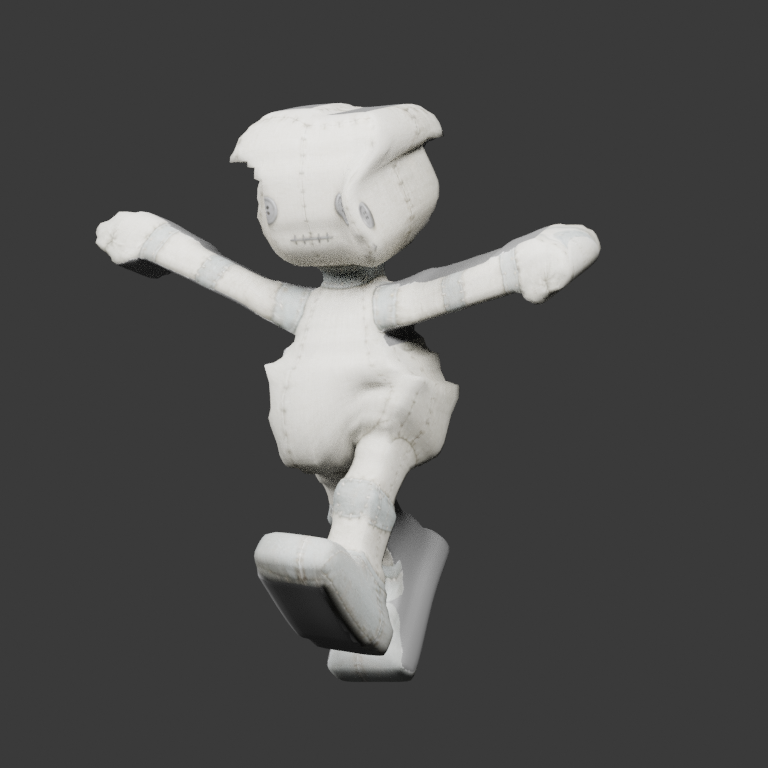
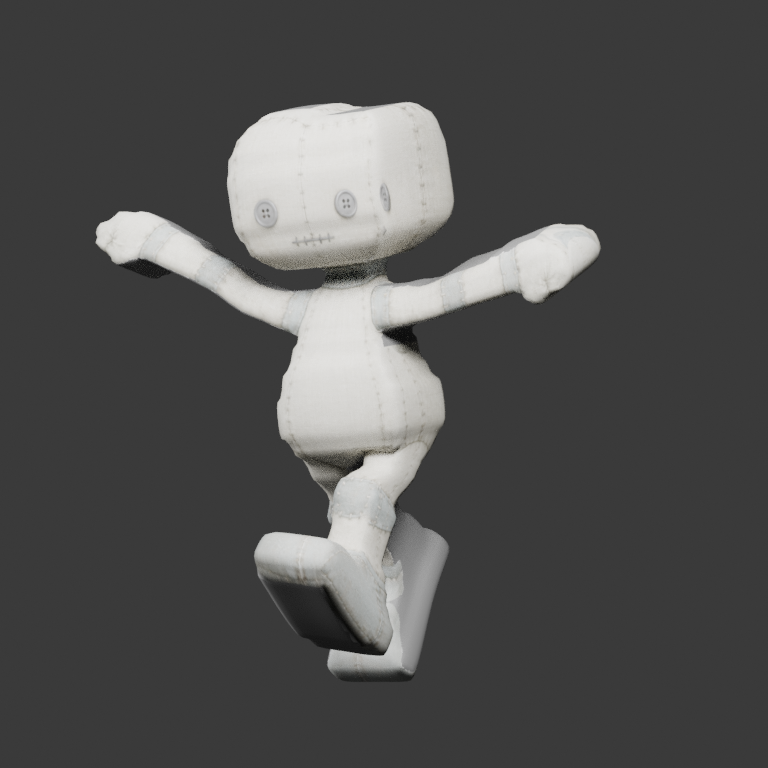

# Stytch workshop doll — authored skin candidate

Distinct #60 candidate. The accepted [original doll](../StytchDoll/README.md) and
the [head-only candidate](../StytchDollHeadIsolated/README.md) are not replaced.

This source-only edit removes distant limb influence from the body and uses
adjacent axial anchors plus local body/limb attachment collars. Collar distances
follow original polygon edges; face ownership is explicitly authored, never
inferred from weights. The observed cranial shell remains rigid to its native
head joint. No joint refit, surface edit, texture rebake or consumer repair.

- 4,193 vertices have intentionally new skin weights; 2,935 distal vertices retain
  their exact original weights. At most four normalized native influences.
- Same 7,128 source vertices / 7,126 faces / 14,252 triangles, five regions, eight
  native-local sockets, eighteen native rest joints, original atlas and **zero clips**.
- `authoring.json`, `partition-authoring.json` and `reference.glb` are byte-identical
  to the original. **The reference GLB contains OLD weights** and is not the new
  selected-source weight oracle. Export fidelity checks the edited Blender source.
- Open `source.blend`, choose another output GLB and use **Export Authored Source
  (No Rebuild)**. Relative authoring paths and packed images survive relocation.

## Exact artifact and evidence

GLB SHA-256: `dc0ba1f2129d09754f0ff53cf609a709338a6946acf1f8f341c8ae4624e4e9bc`.

Editable source SHA-256: `69bb7e8af073c53703dd3e76cc6a1bce72fe7aea5b1628f8ea2d5e661243c724`.

`manifest.json` and `pose-quality.json` bind source/authoring/GLB fingerprints to
generation code `c4f2ad92f7dedcd34dd4e8712eb56aacb125ad7e`, the exact nineteen-pose
index, every pose/matrix proof, and the Stytch capture revision. Captured transforms
still target the original GLB; they are reused here only after proving unchanged
native rest frames and binds. Their provenance is not rewritten to suggest the
consumer captured this new candidate.

All nineteen source → raw GLB → reimport replays pass the unchanged tolerances.
Within the frozen torso cohort, each pose has at least 50% fewer edges outside
the [0.8, 1.2] rest-length ratio and at least 30% lower p95 absolute log strain.
These are regression measurements, **not anatomical or visual acceptance**.

`poses/` contains fourteen Meshvenn/Blender renders: rest and paired original/new
Hall, held, Walk-02 and Hop-11 views, including the captured absent-right-leg state.
No private Stytch screenshot or code is included. Example:

| Original source, Walk-02 | Authored skin candidate, same pose |
| --- | --- |
|  |  |

## Remaining product limits

Hall/held still show shoulder/neck folds and attachment artifacts; native joint
pivots were not refitted. Open removed-limb seams remain intentional and uncapped.
The original two-view atlas still has 56.02% neutral fallback and UV overlap.
**Visual qualification and Stytch consumer acceptance remain false.** Issues #60
and #63 remain open; this candidate does not resume engine/rig/format expansion.

The original images and full editable bundle were explicitly authorized for public
Meshvenn distribution by their supplier. Do not assume a CC0 license; retained
source provenance and publication permission are in `manifest.json`.

Reproduce into a **new empty directory**, without changing this pinned bundle:

```sh
blender --background --factory-startup --python-exit-code 1 \
  --python scripts/refine_workshop_body.py -- \
  --output tmp/authored-skin-candidate --source-sha <tested-code-revision>
```
