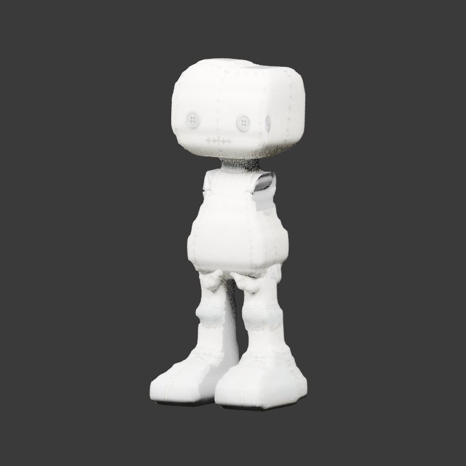
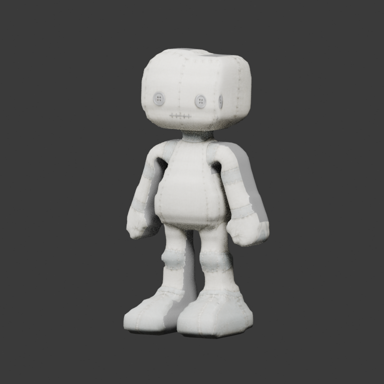

# Workshop doll: observed shoulder origins

This distinct successor to [StytchDollAuthoredSkin](../StytchDollAuthoredSkin/README.md)
corrects the two native upper-arm rest origins. Their legacy heads were roughly
11% of model height above the authored attachment rings, making Hall/held arms
fold into the torso. The explicit **Align Authored Shoulders** command uses the
length-weighted centres of the observed closed body/arm boundaries, translating
each upper-arm head and tail without changing its axes. No new rig engine,
consumer repair, automatic replacement or geometry regeneration is introduced.

| Authored-skin baseline, Hall | Shoulder-aligned GLB, derived Hall |
| --- | --- |
|  |  |

Only `upper_arm.L` and `upper_arm.R` rest origins intentionally change. The 18
native joint names, hierarchy and axes remain; the same 7,128 source vertices,
7,126 quads / 14,252 triangles, weights, UVs, normals, material/atlas, five authored
regions, eight sockets and zero animation clips are retained. Socket parents are
not the moved bones; their float32 cache difference is below the existing native
matrix proof tolerance. The original, head-isolated and authored-skin bundles are
unchanged and remain separately selectable.

The production transaction refuses shared/nonlocal rigs, animated or posed
sources, unsupported socket parents, ambiguous/open/nonmanifold attachment rings
and repeated edits. It stages a separate armature datablock and restores the
original exactly on failure. Ordinary No Rebuild then prepares and exports this
selected source, with all existing source/raw/reimport fidelity gates intact.

## Evidence and provenance

The nineteen synchronized [original probes and matrix proofs](../../poses/StytchDoll/complete/README.md)
still target the original doll, not this new rest rig. The published
`derived-poses/*.json` explicitly calculate:

`new Pose = new Rest * inverse(old captured Rest) * old captured Pose`

They are evidence-only rest-relative replays, **not captures of the new asset**,
pixel matches or a substitute for importing this exact candidate in Stytch.
Each case retains the original probe/proof hashes and hidden regions. Native
source, decoded GLB and reimport agree within the unchanged fidelity limits.
Both frozen shoulder edge cohorts have at least 20% lower p95 absolute log
length strain in every pose; the pinned bundle measures 38–71% reductions.
Hall/held have no edges below a 0.25 length ratio in the tested shoulder/neck
cohorts. This does not certify every edge or every pose: some Hop edges still
collapse, and legacy elbow/hip/head placement remains unqualified.

`pose-quality.json` fingerprints fourteen **own Blender renders** and all derived
probes. Private consumer screenshots, code, controls, loadouts and telemetry are
not included. Visual qualification and consumer acceptance remain false; #60
and #63 still require actual selected-artifact consumer replay. The original
atlas's 56% neutral fallback, reported UV overlap, and open absent-limb seams are
unchanged. Expansion into new engines/rigs/formats remains paused.

| Item | SHA / revision |
| --- | --- |
| `character.glb` | `6654f85acb539e471ccc525f4ffc029409e96e98aeb524df1be95211e860d3f8` |
| `source.blend` | `7d424323bfb70d7cd5abdd36af034ea30f30c210989f35677ef7b4049c71adbd` |
| Source authority snapshot | `0e7dc2647e9464508a25798aa087d30fe8e9c8fdabf1f650fb1961f818c7fae2` |
| Delivered `authoring.json` | `8c9e1e3366d76c23500db4acdf5683257819eed967559cf47d63d37025fcddf9` |
| Delivered `partition-authoring.json` | `06bef713ebceb40fd9d9cddf338dc89ec892561854e05fe86a9e0f5caeceb8d9` |
| `pose-quality.json` | `d12ff2c6f964fa373cb1049bad5e2093c2d61ac869cc337543d0db4d4a89d647` |
| Generator commit | `5cd687e3536b0278224baedac827442b2000718f` |
| Authored-skin baseline GLB | `dc0ba1f2129d09754f0ff53cf609a709338a6946acf1f8f341c8ae4624e4e9bc` |
| Original pose-set index | `151b15b934db6cdf97e4299e5fc096ecb429f098577b403268b13ccf4b12636e` |
| Stytch capture revision | `1c9040e51be1e757c974eca794604cb9553cb532` |

Successor JSON is UTF-8 LF on all platforms. Authoring/partition **values** equal
the preceding bundle; historical Windows CRLF input hashes are not claimed as
delivered-file hashes. The nested body-refinement record describes the preceding
weight edit only, not this later rest-origin correction.

To reproduce into a fresh empty directory using Blender 5.2.1:

```bash
blender --background --factory-startup --python-exit-code 1 \
  --python scripts/align_workshop_shoulders.py -- \
  --output /tmp/shoulder-candidate --source-sha <exact-generator-commit>
blender --background --factory-startup --python-exit-code 1 \
  --python tests/blender_shoulder_alignment_smoke.py -- \
  --variant /tmp/shoulder-candidate --output /tmp/shoulder-verification
```

Keep `source.blend` and `authoring.json` together when relocating the editable
source. Packed images and relative authoring paths support a fresh No Rebuild
re-export, tested against this candidate's own bind/weight authority.
